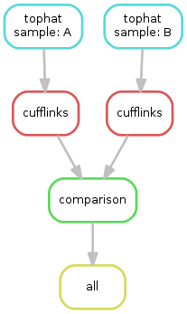

# Snakemake tutorial

## What is snakemake

Snakemake는 특정 Pipeline을 만들기 위한 Python package이다.

가령 Cellline들로 부터 얻은 isoform 발현값들의 비교를 하는 파이프 라인을 짠다고 해보자. 파이프 라인은 다음과 같을 것이다.

```
Raw fastq files(paired end) > Tophat2 > cufflinks > comparison
```
이러한 일련의 과정을 수행하는데 사람이 일일히 다 수행하는 것은 굉장히 번거로운 일이다. 각각의 작업이 언제 끝날지도 모르기 때문이다.

따라서 이러한 파이프라인을 자동화 하여 수행시켜줄 수 있다면, 매우 편리할 것이다. 

**Snakemake는 지정한 Rule에 따라서 파이프라인의 과정을 자동화 해 준다.**

snakemake는 python3 기반의 프로그램이다. 설치는 간단히 pypi를 이용하여.

```
pip3 install snakemake
```
커맨드를 이용하여 설치할 수 있다.


## Mechanism of snakemake

스네이크 메이크는 Default하게 `Snakefile`이라는 파일을 입력으로 받는다.
`Snakefile`은 Rule들과 parameter들을 포함하고 있는 파일이다.
여기서 Rule이란 Pipeline에서 수행되는 각각의 과정들을 의미한다.
위에서 예시로 든 pipeline에서는

	1. Tophat2로 fastq를 reference genome에 align하기
	2. cufflinks로 FPKM값을 구하기
	3. sample들간의 FPKM값의 차이를 구하기

등이 Rule이 될 수 있다.

### Rule

Rule은 방금 언급했듯이 각각의 작업이다.
Rule의 구조는 기본적으로

```
rule rule_name:
     input: input_file
     output: output_file
     params: param1=param1, pram2=param2
     shell: "command --option1 {params.param1} --option2 {params.param2} {input} {output}"
```
의 구조로 되어있다.
- `rule_name` 은 rule의 이름을 지정한다
- `input`은 input\_file을 지칭한다. input\_file이 존재하지 않을경우에는 일정시간(default:5seconds)를 기다린 후 없으면 pipeline의 수행을 abort시킨다.
- `output`은 output\_file을 지칭한다. 해당 작업(rule)을 수행함으로써 만들어지는 output\_file을 지칭한다.
- `params`는 해당 작업에 쓰일 parameter를 지칭한다. 뒤에서 언급하겠지만 Snakefile에서 설정하는 전역변수를 지정할 수 있다.
- `shell`은 수행할 작업 명령이다.
- `shell` 대신 `run`을 쓸수 있는데 이때는 command라인 명령어 대신 python3 코드를 수행할 수 있다

### Construct DAG with rules

Snakemake는 이렇게 정의된 rule**들**로 DAG(Directed Acyclic Graph)를 만든다
가령 rule tophat와 cufflinks를 살펴보자.

```
rule tophat:
     input: fwd="samples/raw/{sample}_1.fastq.gz", rev="samples/raw/{sample}_2.fastq.gz"
     params: GFF=GFF, BowtieIndex=BowtieIndex, LibraryType=LibraryType
     output: "samples/bam/{sample}.bam"
     shell:""" 
	mkdir -p samples/tophat/{wildcards.sample} 
	tophat -p 10 -o samples/tophat/{wildcards.sample} -G {params.GFF} --library-type {params.LibraryType} {params.BowtieIndex} {input.fwd} {input.rev}  
   	mv samples/tophat/{wildcards.sample}/accepted_hits.bam samples/bam/{wildcards.sample}.bam
"""
```
`rule tophat`의 경우 tophat으로 align을 시킨후  결과물인 `samples/tophat/{sample}/accepted_hits.bam`을 `samples/bam/{sample}.bam`으로 옮기는 것을 볼 수 있다.

`rule cufflinks`는 다음과 같다.

```
rule cufflinks:
     input: "samples/bam/{sample}.bam"
     params: GFF=GFF
     output: "samples/cufflinks/{sample}/isoforms.fpkm_tracking"
     shell: "cufflinks -p 10 -G {params.GFF} --output-dir samples/cufflinks/{wildcards.sample} {input}"
```


`rule tophat`의 `output`과 `rule cufflinks`의 `input`이 동일함을 볼 수 있다.

**DAG를 만들기 위하여 각각의 rule들의 input과 output이 명시적으로 같아야 한다**

snakemake는이런 input과 output의 관계를 통하여 DAG를 만들고 DAG에 따라서 작업을 자동적으로 수행하게 된다.

즉 `rule cufflinks`가 수행되기 위해서는 `rule tophat`의 output이 존재해야 된다는 것이다.

수행하는 예제의 DAG는 다음과 같다.




## Parameters and working directory in snakemake

각종 parameter들은 python변수가 지정되듯이 지정될 수 있다.

```
BASE_DIR = "~/snakemake_exercise/"
WDIR = BASE_DIR + "tutorial"
LibraryType = "fr-firststrand"
```
snakemake가 수행되는 working directory는 `workdir`로 지정 될 수 있다.

```
workdir: WDIR
```


## Wildcard in snakemake

아무런 작업도 수행하지 않은 상태에서 sample 폴더의 file tree를 살펴보자.

내가 `cufflinks`와 `tophat`에 계속 사용하고 싶은 이름은 A,B 이다.
```
`-- samples
    `-- raw
        |-- A_1.fastq.gz
        |-- A_2.fastq.gz 
        |-- B_1.fastq.gz 
        `-- B_2.fastq.gz 
```

`glob_wildcards(wildcard)`함수는 wildcard들을 파일로부터 추출해낸다

```
SAMPLES, = glob_wildcards(WDIR+"samples/raw/{sample}_1.fastq.gz")
```
이런식으로 내가 앞으로의 `rule`들에 사용할 wildcard들을 뽑아낼 수 있다.

이 함수의 반환값인 `SAMPLES`는 파이썬 리스트 객체이다. `SAMPLES`의 내용을 살펴보면
```
['A','B']
```
임을 확인할 수 있다.

cufflinks의 결과물인 FPKM들을 비교하는 rule인 `rule comparison`은 **A와 B의 cufflinks의 수행결과가 모두 존재한 이후에 수행되어야 한다.**

```
rule comparison:
     input: expand("samples/cufflinks/{sample}/isoforms.fpkm_tracking", sample=SAMPLES)
     output: "samples/comparison_result.csv"
     run:
       inputs = " ".join(input)
       shell("python comprison.py "+inputs+" {output}")
```
이럴 경우에 `expand(path_with_wildcards, wildcards)`함수를 쓰면 된다. 이 함수는 지정해준 path에 와일드카드들을 매칭시켜준 결과물을 파이썬 리스트로 반환시켜준다.
위의 예시에서 input은
```
['samples/cufflinks/A/isoforms.fpkm_tracking', 'samples/cufflinks/B/isoforms.fpkm_tracking']
```
이 될것이다. 따라서 `rule comparison`은 A와 B의 output이 모두 나오고 나서야 수행될 것이다.

### Mapping wildcards to inputs and outputs of rule.

`rule comparison`을 다시한번 살펴보자.

```
rule comparison:
     input: expand("samples/cufflinks/{sample}/isoforms.fpkm_tracking", sample=SAMPLES)
```
`expand()`함수는 python list object의 값들인 wildcard들을 `rule comparison`에 맵핑해 줌과 동시에 여기에 연결되어있는 `rule cufflinks`의 `output: samples/cufflinks/{sample}/isoforms.fpkm_tracking`에도 매핑을 시켜준다.

이런 매핑은 연쇄적으로 `rule cufflinks`의 `input`과  `rule tophat`의 `output`, 

그리고 `input`으로까지 와일드카드를 매핑할 것이고, 실제 `samples/raw/{sample}_1.fastq.gz, samples/raw/{sample}_2.fastq.gz`가 존재하는 것을 확인한후, 파이프라인을 실행할 것이다.


## Rule all

파이프 라인의 최종 목적은 `rule all`의 input으로 지정할 수 있다. `rule all`은 `output`을 필요로 하지 않는다.

```
rule all:
     input: "samples/comparison_result.csv"
```

## Run snakemake

`rule all`으로 지정된 목적을 결과물로 만들어내기 위해서 snakemake를 수행하려면 Snakefile이 위치한 폴더에서

```
snakemake
```
커맨드를 입력하면 된다.

특정 rule만 실행하고 싶을 경우 output 파일 경로를 입력해 주면된다.
예를들어 `rule tophat` 만 실행하고 싶을 경우

```
snakemake samples/bam/{A,B}.bam
```
커맨드를 입력하면된다.

## Make DAG image file

snakemake는 pipeline의 DAG를 `dot` file로 만들어준다 `graphviz`프로그램이 있으면 image파일로 만들 수 있다.

```
snakemake --dag | dot -Tpng > image_file_name.png
```

## Use cluster

snakemake에서는 여러개의 잡이 병렬적으로 처리될 수 있도록 cluster 에서 잡을 수행할 수 있도록 할 수 있다.

cluster와 job management system이 있다는 가정하에(본 예제에서는 qsub을 사용한다)

```
snakemake --cluster "qsub --qsub-option arg" -j N
```
여기서 N은 한번에 최대 N개의 작업을 수행하도록 할 수 있게 만들겠다라는 의미이다.

## Documentation

더 고급 기능등을 사용하고 싶다면, 공식 Documentation을 참고하도록 하자

https://bitbucket.org/snakemake/snakemake/wiki/Documentation

